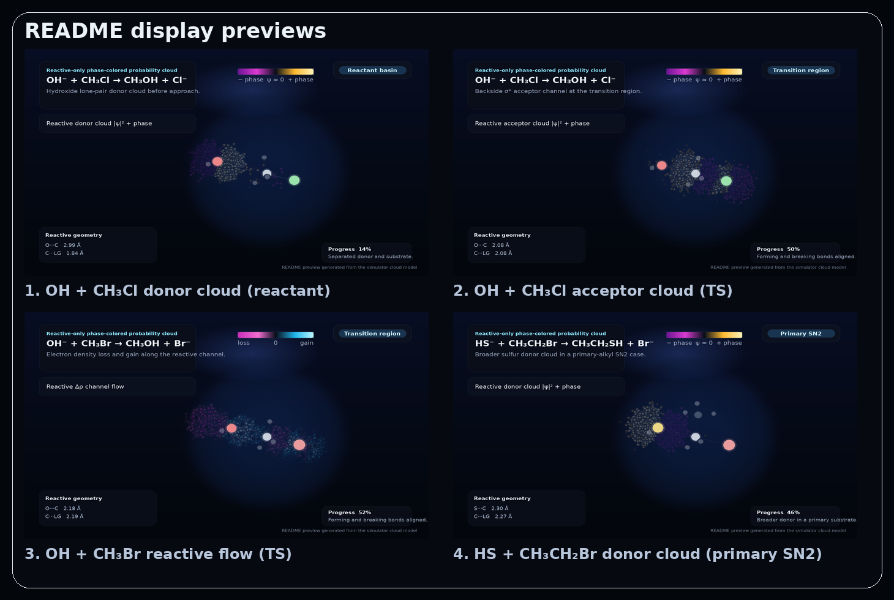

# SN2 Reaction Family Reactive Cloud Simulator (reaction JSON examples)

`OH⁻ + CH₃Cl → CH₃OH + Cl⁻` を基準ケースに、**methyl SN2 / primary alkyl SN2** を切り替えて見られる 3D reactive-only probability cloud シミュレーターです。

この版では次の 2 点を入れています。

1. **particle count は軽いまま、point size は元に戻した**
   - 初期 particle count は `18,000 → 3,600` のまま維持
   - 初期 point size は `0.9 → 4.4` に戻して、雲の体積感を維持
   - 反応中心の見やすさと、cloud の存在感のバランスを取り直しました
2. **reaction JSON の bundled examples を増やした**
   - `examples/reactions/` に複数の JSON 例を同梱
   - object-form / array-form の両方を含む
   - leaving group 比較、donor 比較、primary substrate 系をすぐ読み込めます


## 表示例 PNG

README だけで見た目が伝わるように、代表的な表示例を PNG で同梱しています。下の画像は **現行 UI / 現行 cloud 設定**（`32³ grid`, `3,600 particles`, `point size 4.4`）で書き出した例です。



個別 PNG は `docs/images/` に入っています。

- `preview-01-oh-cl-donor-reactant.png`  
  OH⁻ + CH₃Cl の reactant basin における reactive donor cloud
- `preview-02-oh-cl-acceptor-ts.png`  
  OH⁻ + CH₃Cl の transition region における reactive acceptor cloud
- `preview-03-oh-br-flow-ts.png`  
  OH⁻ + CH₃Br の transition region における reactive Δρ channel flow
- `preview-04-sh-ethyl-br-donor-primary.png`  
  HS⁻ + CH₃CH₂Br の primary SN2 ケースにおける reactive donor cloud

## 何を見せるツールか

表示は「反応に直接関与する電子雲だけ」に限定しています。

- **Reactive donor cloud**  
  求核剤側 donor 成分だけを `|ψ|²` の確率雲で表示
- **Reactive acceptor cloud**  
  backside attack を受ける `σ*` 側 acceptor 成分だけを `|ψ|²` の確率雲で表示
- **Reactive Δρ flow**  
  反応物基準で、反応チャネル内の電子がどこから減ってどこへ増えるかを表示
- **Reactive σ-channel density**  
  nucleophile / carbon / leaving-group の反応軸方向チャネルに投影した密度だけを表示

spectator な C–H / X–H 電子雲は UI 上の主表示から外しています。

## reaction JSON でできること

この版の JSON import は、**SN2 family のうち、いまの幾何生成器で無理なく扱える範囲** に絞っています。

現在サポートしている前提:

- `family`: `methyl-sn2` または `primary-sn2`
- `substrate.type`: `methyl` または `ethyl`
- nucleophile は単一重原子 `Nu` + 任意の `Nu–H` spectator 0〜3 本
- leaving group は単一重原子 `X`
- 対応元素は `H / C / N / O / F / S / Cl / Br / I`

つまり、「任意分子の自由入力」ではなく、**同型の SN2 family を JSON で追加できる** 段階まで実装しています。

JSON schema の詳細は [`docs/reaction-json.md`](./docs/reaction-json.md) にまとめています。すぐ試せるサンプルは [`examples/reactions/`](./examples/reactions/) に入っています。

## bundled reaction JSON examples

- `examples/reactions/minimal-single-reaction.json`
- `examples/reactions/custom-sn2-library.json`
- `examples/reactions/halide-leaving-group-comparison.json`
- `examples/reactions/donor-family-comparison.json`
- `examples/reactions/primary-substrate-series.json`
- `examples/reactions/array-format-example.json`

どのファイルも、そのまま `Reaction JSON import` から読み込めます。ファイルごとの意図は [`examples/reactions/README.md`](./examples/reactions/README.md) にまとめています。

## built-in reactions

- `OH⁻ + CH₃Cl → CH₃OH + Cl⁻`
- `OH⁻ + CH₃Br → CH₃OH + Br⁻`
- `OH⁻ + CH₃I → CH₃OH + I⁻`
- `HS⁻ + CH₃Cl → CH₃SH + Cl⁻`
- `NH₂⁻ + CH₃Cl → CH₃NH₂ + Cl⁻`
- `NH₂⁻ + CH₃Br → CH₃NH₂ + Br⁻`
- `Cl⁻ + CH₃Br → CH₃Cl + Br⁻`
- `F⁻ + CH₃I → CH₃F + I⁻`
- `OH⁻ + CH₃CH₂Cl → CH₃CH₂OH + Cl⁻`
- `HS⁻ + CH₃CH₂Br → CH₃CH₂SH + Br⁻`

## reactive-only の定義

このアプリでいう「反応に関係する電子雲」は、厳密な NBO 解析そのものではありません。次の projector ベース定義を使っています。

1. extended Hückel + 最小 Gaussian 基底で MO を求める
2. nucleophile / carbon / leaving-group の **反応軸 x 方向 σ チャネル** に重みを持つ AO projector を作る
3. occupied 側では、その projector 成分が最も大きい軌道を **reactive donor** として選ぶ
4. virtual 側では、その projector 成分が最も大きい軌道を **reactive acceptor** として選ぶ
5. reactive channel density / flow では、その projector に入る AO 成分だけで密度を再評価する

目的は、**反応に直接関与する電子雲だけを UI 上で安定して比較表示すること** です。

## 計算モデル

1. reaction preset か imported JSON と `progress ∈ [0, 1]` から SN2 反応幾何を生成
2. H / C / N / O / F / S / Cl / Br / I に最小基底 Gaussian AO を配置
3. overlap 行列 `S` を解析的に計算
4. extended Hückel 型 Hamiltonian `H` を構成
5. 一般化固有値問題を解いて MO を得る
6. 密度行列 `P` を構成
7. donor / acceptor / reactive channel の projector を組む
8. `|ψ_reactive|²`, `ρ_reactive(r)`, `Δρ_reactive(r)` を 3D グリッド上で評価
9. importance sampling で point cloud を生成

## 何が正しく、何が近似か

### この版で揃えていること

- donor / acceptor cloud は `|ψ|²` に基づく probability cloud
- density flow は `|Δρ|` で点を打ち、符号は色で分ける
- spectator H basis は reactive projector から外している
- 反応ごとに距離・原子種・電子数要約が切り替わる
- built-in preset と custom JSON の両方を同じ UI で扱える
- bundled example JSON をそのまま import できる

### 近似であること

- 電子状態モデルは extended Hückel
- AO projector による reactive 定義は表示用の近似分解
- 反応経路は手組みの 1D path
- ab initio / DFT cube を直接描いているわけではない
- 任意分子の自由入力と自動反応経路最適化まではまだ入っていない

## 実行方法

```bash
cd sn2-reaction-family-reactive-cloud-simulator-json-examples
python3 -m http.server 8000
```

ブラウザで次を開きます。

```text
http://localhost:8000
```

## reaction JSON の読み込み方

1. `examples/reactions/` から読み込みたい `.json` を 1 つ選ぶ
2. 画面左の **Reaction JSON import** でそのファイルを指定する
3. **Load JSON** を押す
4. selector の `Imported JSON` グループから新しい反応を選ぶ

built-in だけに戻したいときは **Built-ins only** を押します。

## テスト

```bash
npm test
```

この版では、既存の数値テストに加えて次も確認しています。

- reaction JSON schema の正規化
- unsupported family の拒否
- custom reaction JSON の runtime import / reset
- JSON 由来 reaction object から幾何が組めること
- 同梱した example JSON ファイルがすべて parse できること

## ディレクトリ構成

```text
sn2-reaction-family-reactive-cloud-simulator-json-examples/
├─ index.html
├─ package.json
├─ README.md
├─ .gitignore
├─ docs/
│  ├─ architecture.md
│  ├─ interview-notes.md
│  ├─ reaction-json.md
│  ├─ scientific-model.md
│  ├─ test-plan.md
│  └─ images/
│     ├─ readme-preview-grid.png
│     ├─ preview-01-oh-cl-donor-reactant.png
│     ├─ preview-02-oh-cl-acceptor-ts.png
│     ├─ preview-03-oh-br-flow-ts.png
│     └─ preview-04-sh-ethyl-br-donor-primary.png
├─ examples/
│  └─ reactions/
│     ├─ README.md
│     ├─ minimal-single-reaction.json
│     ├─ custom-sn2-library.json
│     ├─ halide-leaving-group-comparison.json
│     ├─ donor-family-comparison.json
│     ├─ primary-substrate-series.json
│     └─ array-format-example.json
├─ src/
│  ├─ chemistry/
│  │  ├─ elements.js
│  │  ├─ reactionPath.js
│  │  ├─ reactionPresets.js
│  │  └─ reactionSchema.js
│  ├─ data/
│  │  └─ reactions/
│  │     └─ catalog.json
│  ├─ math/
│  │  ├─ matrix.js
│  │  └─ numerics.js
│  ├─ physics/
│  │  ├─ gaussianBasis.js
│  │  ├─ extendedHuckel.js
│  │  ├─ reactiveSpace.js
│  │  └─ sampler.js
│  ├─ render/
│  │  ├─ colorMap.js
│  │  ├─ cloudSampler.js
│  │  ├─ cloudTransition.js
│  │  ├─ scene3d.js
│  │  └─ energyDiagram.js
│  ├─ worker/
│  │  └─ densityWorker.js
│  ├─ main.js
│  └─ styles.css
└─ tests/
   ├─ cloudSampler.test.js
   ├─ cloudTransition.test.js
   ├─ extendedHuckel.test.js
   ├─ gaussianBasis.test.js
   ├─ reactionExampleFiles.test.js
   ├─ reactionJson.test.js
   ├─ reactionPath.test.js
   ├─ reactionPresets.test.js
   ├─ reactiveSpace.test.js
   └─ sampler.test.js
```

## 次に伸ばすなら

- secondary substrate まで広げて `ethyl` 以外も定義できるようにする
- leaving-group / nucleophile を多原子片まで広げる
- cube file import と同じ UI に統合する
- point inspection / slice plane を追加して donor–acceptor 重なりを局所比較しやすくする
